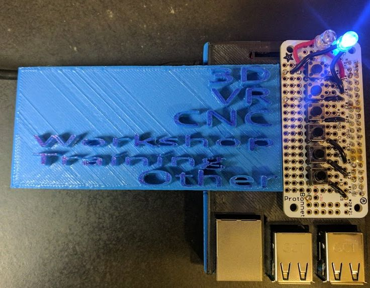
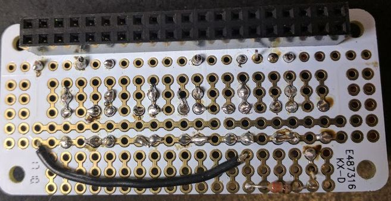

# PiTab

# The RaspberryPi flavour of the Tabularon

This is the 21st century version of an electronic tabulation device first appearing in [code4Lib](http://journal.code4lib.org/articles/8200) journal. Basically this device, once configured will send a value to a Google Spreadsheet that corresponds to one of the 6 buttons on the device. The handy picture above is how we have it configured. You essentially make HTTP GET commands against that form and it will populate. Details in that link.

This version of the tabulatron is fully autonomous. Once you have the device connected and running it will communicate to the web directly (Used to be Arduino connected to a CPU... it was very fussy)

If using a RaspberryPi 3 you can use the onboard wifi to connect to Eduroam.

## Part List
- 2 LEDS (different color)
- 6 push [buttons](https://www.adafruit.com/product/367)
- 330 OHM resistor
- AdaFruit RaspiZero Proto [Shield](https://www.adafruit.com/product/3203) 
- some small gauge wire to connect the buttons
- To encapsulate it all I printed [this](https://www.thingiverse.com/thing:2292745) Raspberry Pi case

## Solder time
Hopefully the two images (one above and the one below) will give you the jist. The only tricky part is soldering on the resistor underneath the proto board along with the jumper wire from the ground on the other side of the board.

## Setup
- [Setup](https://www.raspberrypi.org/documentation/installation/installing-images/) your micro SD card with the basic version of raspberry Pi
- Use `sudo raspi-config` to have the device automatically boot and login to CLI
- Download/Clone the software from github (if you are reading this look for the download button up and to the right)
- The bash script `deploy` does most of the automatic processes
- edit `setttings.py` to set what 6 URLs you want the software to try to grab for each button
- `sudo python3 piTab.py` in the directory where you cloned it will start up the application

## Network Config
- You can connect the pi either using a LAN cable for Wifi
- There is lots of info out there about connected to a WPA2 wifi network using CLI. Heres a good [one](https://learn.adafruit.com/adafruits-raspberry-pi-lesson-3-network-setup/setting-up-wifi-with-occidentalis)

## Eduroam
- It is possible to connect to an eduroam network with just the bare amount of fussing as follows:
- `sudo nano /etc/network/interfaces`

- add the following 5 lines

`auto wlan0`
`allow-hotplug wlan0`
`iface wlan0 inet dhcp`
`wpa-conf /etc/wpa_supplicant/wpa_supplicant.conf`

- Then you will need to edit the wpa supplicant file to localize
- `sudo nano /etc/wpa_supplicant/wpa_supplicant.conf`

- add the following (use in  house directives as necessary)

`country=CA`
`ctrl_inter=DIR=/var/run/wpa_supplicant GROUP = netdev`
`update_config=1`
`network = {`
`identity="user@school.edu"`
`password="somepassword"`
`eap=PEAP`
`phase2="auth=MSVCAPV2"`
`ssid=eduroam`
`key_mgmt=WPA_EAP`
`}`

- You can add other `network` descriptions here as well
- Once you reboot you should be able to get an IP

## Make script run on startup
- add the following line to your crontab
`@reboot sudo /home/pi/piTab/boot_script`
- details on cron can be found [here](https://en.wikipedia.org/wiki/Cron)

## Misc
- A log of button presses is kept in `button_log.log`, this is useful for debugging
- Two lights, one stays on to let you know that it is working, both blink on each button press
- If the one light light shuts off, time to reboot/slash troubleshoot
- You do not have to plug in a monitor/keyboard, once you configure it to run on startup you can <ronco>set it and forget it</ronco>
- `<EASTER EGG>`You can force a connection test, check the code to see if you can find out how `</EASTER EGG>`

